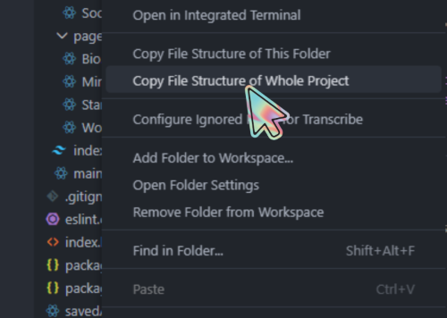
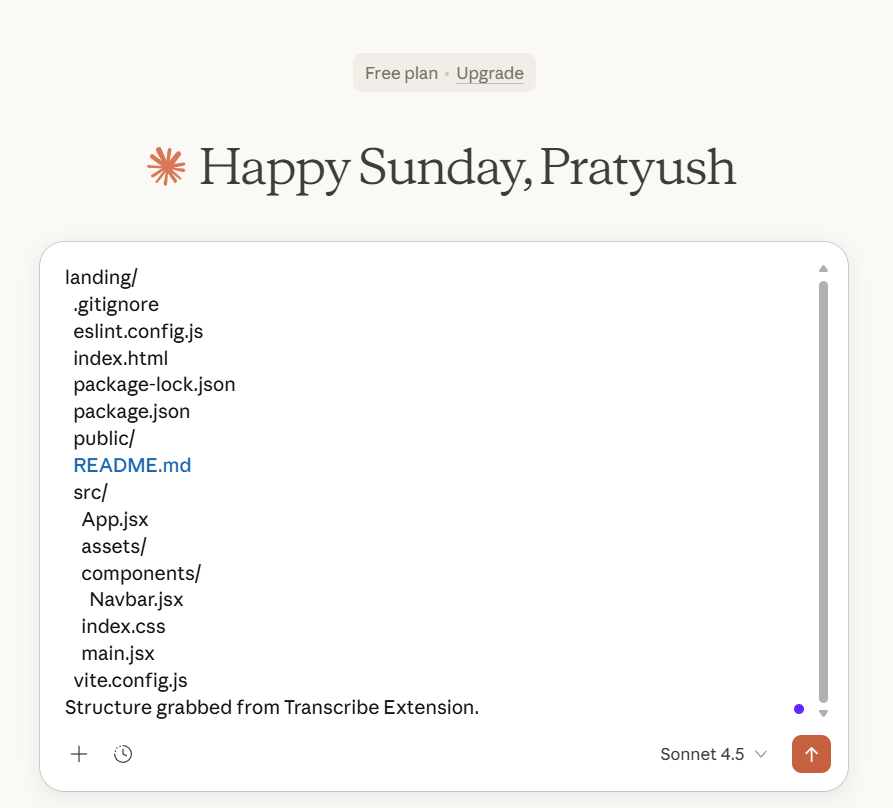
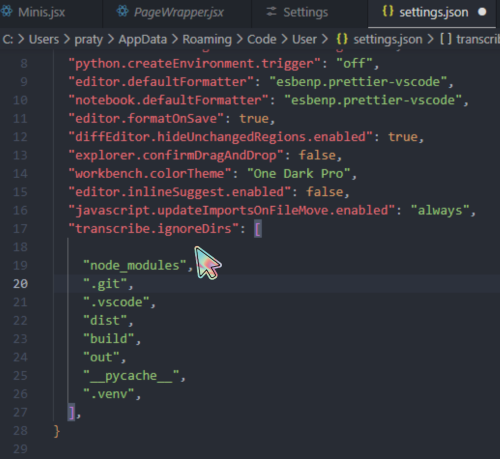

# Transcribe

A VSCode Extension that copies your file structure so you can use it in your favorite chatbots to speed up development.

Very simple but solves a real pain point. Your welcome.

email pratyushv09@gmail.com for any tips, feedbacks, or bugs.

## Features

### Copy entire project structure in one click

### Copy specific folder structures

### Clean AI-ready output

### Edit ignored folders using IgnoreDir Settings

